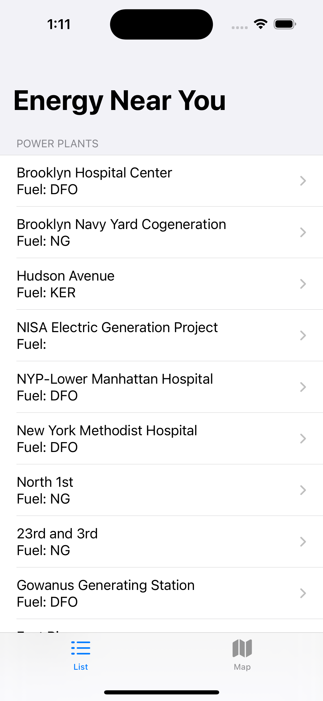
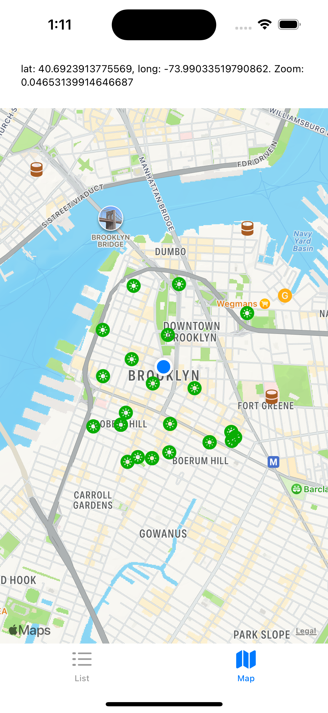
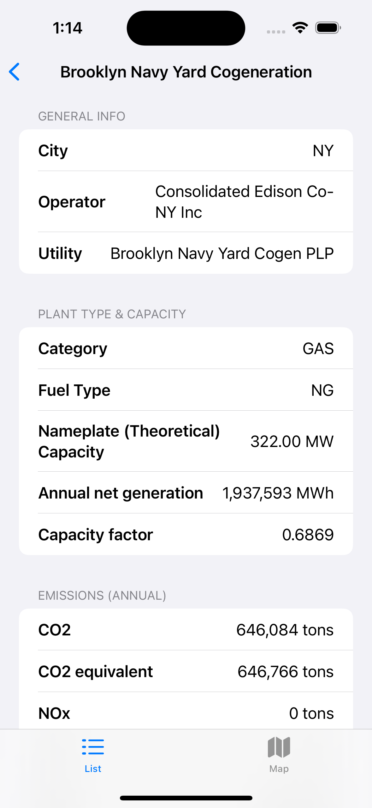
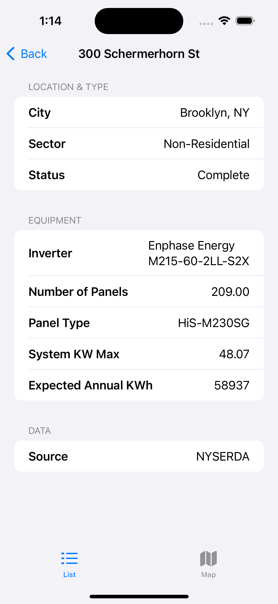

# iOSEnergyViz
iOS SwiftUI App to Visualize Nearby Energy Infrastructure using MapView. The app currently pulls from [NYSERDA's Solar Electric Programs](https://dev.socrata.com/foundry/data.ny.gov/3x8r-34rs) and from the [EPA's eGRID database](https://www.epa.gov/egrid) via [egrid-server](https://github.com/hbridge/egrid-server).

## Screenshots

 
  

# Build and Run

This app has no build dependencies.  Open the project .xcodeproj file and Build/Run
